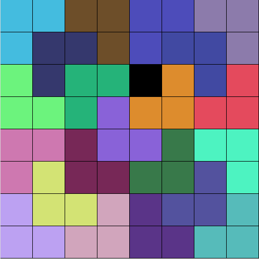
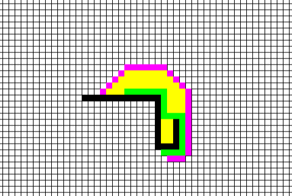
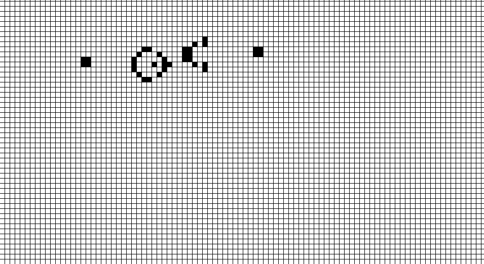
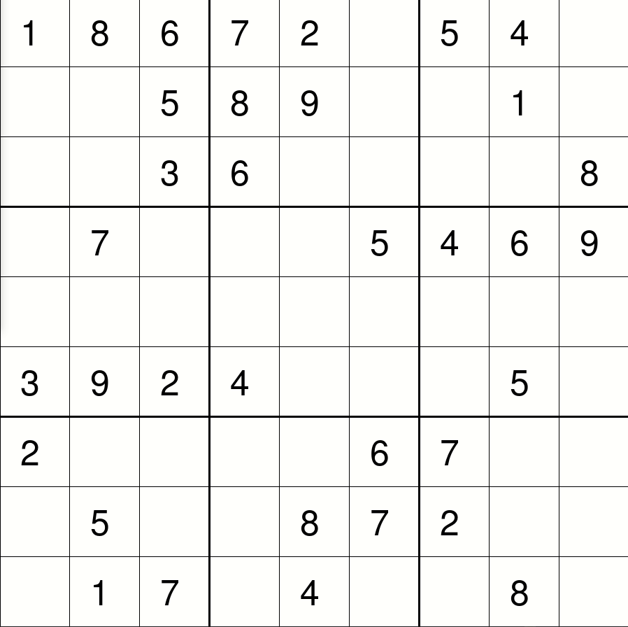

# python-algorithms
Algorithms and their visualization implemented in Python

## Table of contents
* [L pavage](#l-pavage)
* [Graph exploration](#graph-exploration)
* [Conway's Game of Life](#conway-s-game-of-life)
* [Backtracking](#sudoku-solver-with-backtracking)

## L Pavage
### Problem
We consider a square grid of length *n* = 2<sup>*l*</sup> with a forbiden square of coordinate *i, j*.
We want to pave the grid (except the forbiden square) with tiles of three square in form of L.
### Example

### Launch
```
python3 lpavage.py l speed
```
With
- 2<sup>*l*</sup> the length of the square  
- *speed* the time in *ms* between each step of the algorithm

### Requirement
* `tkinter`

## Graph exploration
3 graph exploration algorithm are implemented in `astar.py`
- [A*](https://en.wikipedia.org/wiki/A*_search_algorithm)
- [Weighted A*](https://en.wikipedia.org/wiki/A*_search_algorithm#Bounded_relaxation)
- [Breadth First Search](https://en.wikipedia.org/wiki/Breadth-first_search) (same as [Dijkstra](https://en.wikipedia.org/wiki/Dijkstra%27s_algorithm) in this case)
### Example


### Launch
```
python3 astar.py w
```
#### Option
`w` is an option, it is the weight of heuristic in weighted A*, there is 3 possibility
- 0: there isn't any heuristic and A* juste become Breadth first search
- 1: basic A* heuristic (`python3 astar.py` also does the basic A* algorithm)
- \>1: Weighted A* with a weight of `w`

#### Step
1. Start drawing the wall of your grid
2. Press space when you want to place the start node
3. Left click to place it
4. Then left click again to place the goal node
5. Press space to reset the grid and start again

#### Results
In green you will have the shortest path\
In yellow, all the explored node\
In magenta, all the discovered, but not explored node
In white all the non discovered node

### Requirement
* `pygame`

## Conway's Game of life
A simple visualization of Conway's famous [Game of Life](https://en.wikipedia.org/wiki/Conway%27s_Game_of_Life)
### Example

### Launch
```
python3 game_of_life.py
```
### Requirement
* `pygame`

## Sudoku solver with backtracking
A sudoku resolver using the [backtracking algorithm](https://en.wikipedia.org/wiki/Backtracking)

### Launch
`python3 backtracking.py`

#### Option
`python3 backtracking.py file` where file is a file describing a sudoku \
To describe a sudoku the file must contain 9 row of 9 numbers without any space (only numbers and line break). Empty box of the sudoku should be replaced by 0. You can see an example [here](sudoku), which is the default used sudoku.
### Requirements
* `pygame`
* `tkinter`


### Example

