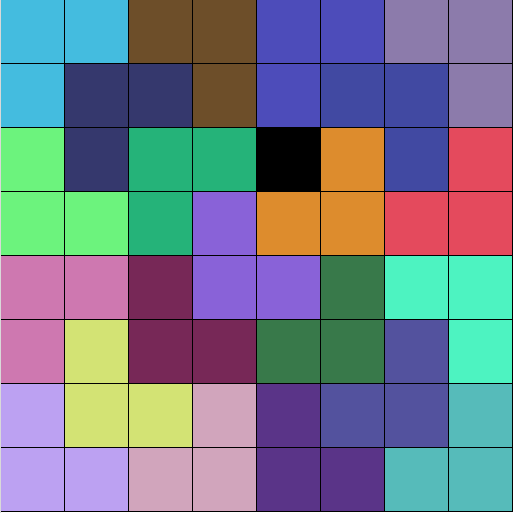

# python-algorithms
Algorithms and their visualisation implemented in Python
## LPavage
### Problem
We consider a square grid of length *n* = 2<sup>*l*</sup> with a forbiden square of coordinate *i, j*.
We want to pave the grid (except the forbiden square) with tiles of three square in form of L.
### Example

### Launch
```
python3 lpavage.py l speed
```
With
- 2<sup>*l*</sup> the length of the square  
- *speed* the time in *ms* between each step of the algorithm
