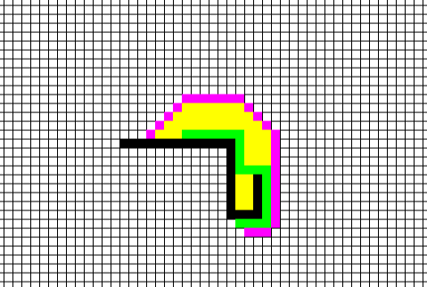

# python-algorithms
Algorithms and their visualisation implemented in Python
## LPavage
### Problem
We consider a square grid of length *n* = 2<sup>*l*</sup> with a forbiden square of coordinate *i, j*.
We want to pave the grid (except the forbiden square) with tiles of three square in form of L.
### Example

### Launch
```
python3 lpavage.py l speed
```
With
- 2<sup>*l*</sup> the length of the square  
- *speed* the time in *ms* between each step of the algorithm

## A*
Visualisation of the famous A* algorithm wich find the shortest path in a graph wich is represented here by a grid
### Example


### Launch
```
python3 astar.py
```
- Start drawing the wall of your grid
- Press space when you want to place the start node
- Left click to place it
- Then left click again to place the goal node
- Press space to reset the grid and start again

In green you will have the shortest path\
In yellow, all the explored node\
In purple, all the discovered, but not explored node
